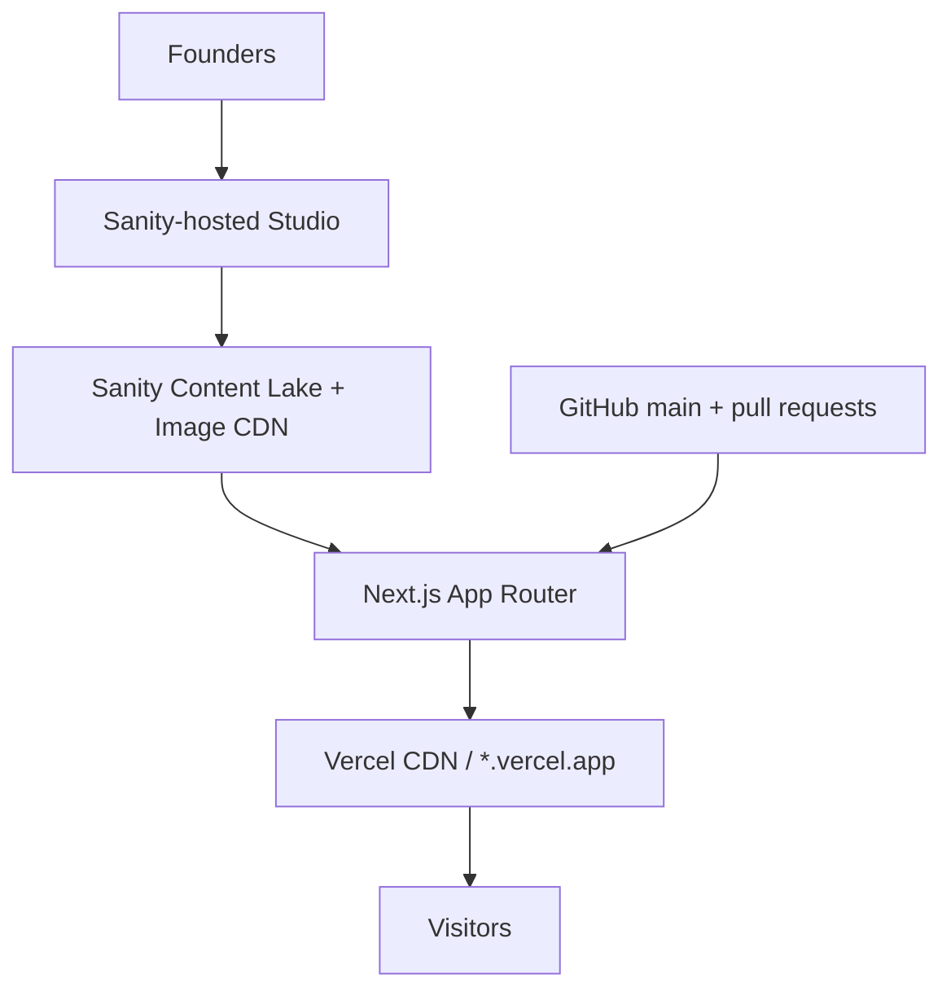

# Sri Lankan Gaming Alliance Website - Phase 1 Technical Specification

**Document status:** Approved for implementation  
**Version:** 1.0  
**Date:** 13 September 2026  
**Project:** SLGA official website rebuild  
**Repository:** `slgaofficial/slgaofficial.github.io`

## 1. Executive decision

Replace the legacy single-page static site with a new, English-first website built with Next.js 16+, TypeScript, App Router, Tailwind CSS, and a deliberately small set of shadcn/ui components. Editorial content will be managed in a separately hosted Sanity Studio. The public site will deploy to Vercel from the existing GitHub repository.

Phase 1 has one purpose: give SLGA a current, credible, fast official home that founders can maintain without editing code.

The public product consists of:

1. A modern homepage.
2. English and Sinhala Rules pages.
3. An Announcements index with permanent announcement pages.
4. Manually curated Facebook feature cards.
5. Prominent Facebook and Discord join links.
6. Search/social metadata and basic privacy-friendly analytics.

It does **not** include public accounts, a custom admin system, events, news aggregation, forums, LFG, Discord bots, or Facebook API ingestion.

## 2. Confirmed product decisions

| Area | Phase 1 decision |
| --- | --- |
| Frontend | Next.js 16.x, TypeScript, App Router |
| Public hosting | Vercel; use the assigned `*.vercel.app` production domain initially |
| CMS | Sanity Content Lake + Sanity-hosted Studio |
| Editors | 1-3 trusted founders |
| Public language | English by default |
| Sinhala | Only Rules content is bilingual in Phase 1 |
| Announcements | English; index plus permanent `/announcements/[slug]` pages |
| Facebook features | Manual cards linking to original Facebook posts; no embeds/API |
| Media | Uploaded through Sanity and delivered through Sanity's image CDN |
| UI | Tailwind CSS + selected shadcn/ui components; complete visual overhaul |
| Visual direction | Minimal, dark, two-tone gaming identity |
| Analytics | Vercel Web Analytics, including Facebook/Discord CTA click events |
| Delivery | `main` deploys to production; pull requests receive Vercel previews |
| Existing site | Replaced, with Git history and a pre-rebuild tag preserving the legacy version |
| Repository | Continue using `slgaofficial/slgaofficial.github.io` |

## 3. Current-state findings and migration posture

The present site is one hand-authored `index.html` page with compiled SCSS/CSS, vanilla JavaScript, Swiper, ScrollReveal, and local images. All content is embedded in HTML. It has no CMS, package manifest, backend, API, test suite, or build pipeline.

The legacy site is not a component or code foundation for the rebuild. Its content is migration input only. Reasons include:

- stale `24,000+` membership copy;
- a 2021 copyright date;
- Facebook-specific rules mixed directly into page layout;
- no Discord presence;
- inactive template code for video, theme, sponsor, and other sections;
- JavaScript that can access commented-out elements and fail at runtime;
- manually maintained media and external rules-document linking.

Before replacing it, create an annotated Git tag such as `legacy-site-2021` from the final legacy commit. Preserve the repository history. Do not copy unused template JavaScript, CSS, libraries, or decorative assets into the new application.

## 4. Goals and success measures

### 4.1 Goals

- Communicate SLGA's current identity as the home for Sri Lankan gamers.
- Convert visitors toward the Facebook community and Discord server.
- Make homepage copy, social links, member count, rules, announcements, and featured Facebook cards editable without code changes.
- Keep Rules authoritative, easy to read, and available in English and Sinhala.
- Give every announcement a stable, shareable, indexable URL with an effective social preview.
- Deliver excellent mobile usability and performance on slower connections.
- Keep hosting and CMS costs at zero while the project remains eligible for the selected free plans and stays within their quotas.

### 4.2 Initial measures

Track these after launch:

- page views by route;
- clicks on Join Facebook;
- clicks on Join Discord;
- clicks from featured cards to Facebook posts;
- most-viewed announcements;
- mobile/desktop traffic split;
- production Core Web Vitals when enough real-user data exists.

No numeric growth promise is part of Phase 1. The first 30 days establish a baseline.

## 5. Explicit non-goals

The following are outside Phase 1:

- member registration, login, profiles, or Discord OAuth;
- LFG, matchmaking, rankings, leaderboards, or game directories;
- event or tournament management;
- creator, streamer, sponsor, or partner directories;
- comments, reactions, forums, messaging, or notifications;
- community submission forms or moderation workflows;
- full gaming-news publishing;
- Facebook embeds, scraping, Graph API synchronization, or automatic importing;
- live Discord member counts or bot integration;
- a custom CMS, database, admin dashboard, or authentication system;
- scheduled publishing, approval chains, or granular editorial roles;
- site-wide Sinhala localization or Tamil localization;
- a mobile app or PWA/offline mode;
- a custom domain in Phase 1.

Adding one of these requires a separately approved Phase 2 scope; it must not be slipped into the initial build.

## 6. Users and core journeys

### 6.1 Visitor

The visitor can:

- understand what SLGA is within the first screen;
- join Facebook or Discord with one clear action;
- read current rules in English or Sinhala;
- browse official announcements and open a permanent announcement URL;
- open selected community content on Facebook;
- use the site comfortably on a phone, keyboard, or assistive technology.

### 6.2 Founder/editor

An authenticated founder can use Sanity Studio to:

- update homepage copy, member count, images, and social URLs;
- create, reorder, enable, disable, and edit bilingual rules;
- draft, preview, publish, update, and unpublish announcements;
- add, reorder, enable, disable, and remove featured Facebook cards;
- upload and crop images and provide alternative text;
- review Sanity document history when a content mistake occurs.

No website-admin login exists on the public Next.js application.

## 7. Information architecture and routes

| Route | Purpose | Source | Indexing |
| --- | --- | --- | --- |
| `/` | Homepage | Sanity `siteSettings`, latest announcement, featured Facebook posts | Index |
| `/rules` | English Rules | Sanity active rules | Index |
| `/si/rules` | Sinhala Rules | Same Sanity rule documents | Index, `hreflang="si"` |
| `/announcements` | Published announcement list | Sanity announcements | Index |
| `/announcements/[slug]` | Permanent announcement detail | One Sanity announcement | Index |
| `/privacy` | Concise static privacy/analytics notice | Code-owned content approved before launch | Index |
| `/robots.txt` | Crawler policy | Next.js metadata file | N/A |
| `/sitemap.xml` | All indexable routes and published announcements | Next.js metadata file + Sanity query | N/A |
| unmatched route | Branded 404 with Home/Rules links | Code | No index |

The primary navigation is **Home · Rules · Announcements**, followed by a visually prominent **Join Discord** action. Join Facebook remains equally prominent in the homepage hero.

The site does not have a global language switch. Only the Rules pages display an **English / සිංහල** language control. `/rules` and `/si/rules` are real URLs rather than a client-only toggle so each version is shareable and accessible.

## 8. Page specifications

### 8.1 Global header

- SLGA logo/wordmark links to `/`.
- Desktop navigation: Home, Rules, Announcements, Join Discord.
- Mobile navigation: shadcn `Sheet` with the same destinations.
- Header becomes solid after the page scrolls; it must not obscure anchored or focused content.
- The current page is indicated visually and through `aria-current="page"`.
- External CTA labels include accessible context; links open in a new tab only when that behavior is clearly indicated.

### 8.2 Homepage

Render sections in this order:

1. **Hero** - editable eyebrow, heading, summary, optional hero image, member-count proof point, Join Facebook, and Join Discord.
2. **About SLGA** - one short editable heading and body; no long history timeline.
3. **Latest announcement** - the newest published announcement, or the founder-selected featured announcement if configured.
4. **Featured from our community** - up to three active, manually curated Facebook cards.
5. **Community links** - Facebook, Discord, and optional enabled social channels.
6. **Footer** - copyright uses the current year automatically; social links, Rules, Announcements, and Privacy.

Empty-state rules:

- Hide Latest announcement if none is published.
- Hide Featured from our community if no cards are active.
- Never display placeholder member counts or invented metrics.
- Facebook and Discord URLs are required before production launch.

### 8.3 Rules

- Introductory copy and `Last updated` date appear above the rule list.
- Each active rule displays its explicit order number, localized title, and localized Portable Text body.
- English and Sinhala values live on the same rule document and publish together.
- Missing Sinhala content blocks publication through Studio validation; the public site must never silently fall back to English on `/si/rules`.
- Rules are ordered by `displayOrder`, then `_createdAt` as a deterministic fallback.
- Rules use headings and readable blocks, not an image carousel.
- The page language is correctly declared: `<html lang="en">` for `/rules` and a page-level Sinhala content wrapper with `lang="si"` for `/si/rules`. If a separate localized layout is implemented, its document language should be `si`.

### 8.4 Announcements index

- List published announcements newest first.
- Each card contains title, human-readable publication date, excerpt, optional image, and link.
- Phase 1 uses simple pagination only if published announcements exceed 24; otherwise show all.
- Drafts and documents with a future `publishedAt` are excluded from public queries.

### 8.5 Announcement detail

- Stable URL from the Sanity slug.
- Title, publication date, optional cover image with alt text, and Portable Text body.
- Back link to `/announcements`.
- Per-page canonical URL, title, description, Open Graph image, and `Article` JSON-LD.
- Unknown or unpublished slugs return the branded 404, not an empty 200 response.

### 8.6 Featured Facebook cards

- Maximum of three on the homepage.
- Each card uses a founder-supplied image, title, short description, and original Facebook URL.
- Cards are normal website UI, not Facebook embeds.
- Opening the original post records an analytics event.
- Do not proxy Facebook content or imply that a card updates automatically.

## 9. Visual and interaction design

### 9.1 Direction

Use a restrained, modern gaming aesthetic, not a generic esports template.

Core palette:

| Token | Value | Use |
| --- | --- | --- |
| `--background` | `#080B12` | Main background |
| `--foreground` | `#F6F8FB` | Primary text |
| `--accent` | `#20D6E7` | CTA, focus, active state |
| `--surface` | `#111722` | Cards and elevated areas |
| `--muted` | `#9BA7B7` | Secondary text |
| `--border` | `#253041` | Dividers and borders |

This is an **obsidian + electric-cyan** identity. White and derived gray values are neutral utility colors, not extra brand tones. Final implementation must verify WCAG contrast and may adjust token luminance without changing the direction.

Typography:

- English UI: Geist Sans or an equivalent locally optimized sans font through `next/font`.
- Sinhala rules: Noto Sans Sinhala through `next/font`, with system fallbacks.
- Do not request fonts from Google at runtime.

Layout and motion:

- content maximum width: approximately 72rem;
- readable article/rules measure: approximately 68-75 characters;
- mobile-first layout with meaningful breakpoints rather than device-specific hacks;
- minimum interactive target: 44 × 44 CSS pixels;
- subtle opacity/translation transitions only;
- no autoplay media, parallax, large carousel, cursor effect, continuous animation, or heavy background video;
- respect `prefers-reduced-motion`.

### 9.2 shadcn/ui usage

Use shadcn/ui as source-owned components, not as a requirement to make every element a component. Expected components:

- `Button`
- `Card`
- `Badge`
- `Separator`
- `Sheet` for mobile navigation
- `Skeleton` only if runtime loading is actually visible

Avoid adding a component until the design uses it. Style with project tokens rather than shipping shadcn defaults unchanged.

## 10. Technical architecture



### 10.1 Frontend baseline

- Next.js 16.x, App Router.
- React version selected by the compatible Next.js release.
- TypeScript with `strict: true`.
- Tailwind CSS.
- shadcn/ui, adding only used components.
- `next-sanity` for the Sanity client and typed queries.
- `@portabletext/react` for allowlisted Portable Text rendering.
- `@sanity/image-url` plus `next/image` for transformed responsive media.
- `@vercel/analytics` for analytics.
- `lucide-react` for interface icons.
- pnpm and a committed lockfile.
- Node.js must meet the selected Next.js 16 release requirement; Next.js documentation currently specifies Node.js 20.9 minimum. CI and Vercel should use the same supported LTS major.

Pin major versions in `package.json`; commit the exact resolved versions in `pnpm-lock.yaml`. Use the latest stable patch releases when implementation begins, after running the test suite.

### 10.2 Rendering and caching

- Use React Server Components by default.
- Use Client Components only for mobile navigation, necessary interaction, and analytics event dispatch.
- Fetch published content from Sanity in server code.
- Use the Sanity API CDN for production reads.
- Cache public CMS queries with 60-second time-based revalidation.
- Content changes therefore require no Vercel code deployment and should appear publicly within approximately one minute.
- The announcement detail route uses `generateMetadata` from the same fetched document.
- Do not expose a Sanity write token to the browser or frontend runtime.

Phase 1 does not require a webhook. A signed Sanity webhook and tag-based on-demand revalidation may replace the 60-second policy later if near-instant updates become operationally important.

### 10.3 Resilience

- A production build must fail if required site settings cannot be loaded; do not deploy an empty shell.
- Optional sections hide cleanly when their documents do not exist.
- A previously cached production page should remain available during a brief CMS-origin interruption where platform caching permits.
- Sanity image fields must define dimensions/aspect behavior to prevent layout shift.
- All Sanity query results receive generated TypeScript types; avoid untyped `any` content plumbing.

## 11. Sanity content model

Use one public dataset named `production`. Public datasets are appropriate because Phase 1 contains only public website content. Never place private member data, credentials, moderation reports, unpublished secrets, or internal operational notes in this dataset.

### 11.1 `siteSettings` - singleton

Only one document may be created or edited.

| Field | Type | Required | Notes |
| --- | --- | --- | --- |
| `siteName` | string | Yes | Default `Sri Lankan Gaming Alliance` |
| `shortName` | string | Yes | Default `SLGA` |
| `heroEyebrow` | string | No | Short identity line |
| `heroHeading` | string | Yes | English; newline characters define the intentional stacked display lines |
| `heroBody` | text | Yes | English; length validation |
| `heroImage` | image + alt | No | Hotspot enabled |
| `memberCount` | number | Yes | Integer, non-negative |
| `memberCountLabel` | string | Yes | Example: `community members` |
| `memberCountSource` | string | Yes | Public provenance for the founder-verified count |
| `aboutHeading` | string | Yes | English; newline characters may define stacked display lines |
| `aboutBody` | Portable Text | Yes | Restricted block styles |
| `aboutFacts` | array of objects | Yes | Two to four homepage facts: stable key, title, description |
| `socialLinks` | array of objects | Yes | Platform, label, URL, enabled, order |
| `featuredAnnouncement` | reference | No | Falls back to newest published |
| `rulesHeadingEn` | string | Yes | English |
| `rulesHeadingSi` | string | Yes | Sinhala |
| `rulesIntroEn` | text | Yes | English |
| `rulesIntroSi` | text | Yes | Sinhala |
| `rulesOutroTitleEn` | string | Yes | English rules closing-panel title |
| `rulesOutroTitleSi` | string | Yes | Sinhala rules closing-panel title |
| `rulesOutroBodyEn` | text | Yes | English rules closing-panel body |
| `rulesOutroBodySi` | text | Yes | Sinhala rules closing-panel body |
| `rulesLastUpdated` | date | Yes | Displayed on both versions |
| `seoTitle` | string | Yes | Default metadata title |
| `seoDescription` | text | Yes | Target roughly 120-160 characters |
| `defaultOgImage` | image + alt | Yes | 1200 × 630 recommended |

Allowed social platforms initially: Facebook, Discord, Steam, Reddit, Instagram, YouTube. Facebook and Discord must be enabled and have valid HTTPS URLs before launch.

### 11.2 `rule`

| Field | Type | Required | Notes |
| --- | --- | --- | --- |
| `title.en` | string | Yes | English title |
| `title.si` | string | Yes | Sinhala title |
| `body.en` | Portable Text | Yes | English content |
| `body.si` | Portable Text | Yes | Sinhala content |
| `displayOrder` | number | Yes | Integer ≥ 1; warn on duplicates |
| `enabled` | boolean | Yes | Defaults to true |

Use field-level localization because each rule mixes shared fields with two language values and both versions must publish together. Sanity explicitly describes this pattern as suitable for documents containing language-specific and shared fields.

Portable Text for rules permits paragraphs, `h3`, bold, italic, links, ordered lists, and bullet lists. It does not permit raw HTML, embedded scripts, arbitrary iframes, or large media blocks.

### 11.3 `announcement`

| Field | Type | Required | Notes |
| --- | --- | --- | --- |
| `title` | string | Yes | English; sensible length validation |
| `slug` | slug | Yes | Generated from title, unique, immutable after publication unless redirect is added |
| `kind` | string | Yes | One of `ANNOUNCEMENT`, `RULES UPDATE`, `COMMUNITY`, `EVENT`; defaults to `ANNOUNCEMENT` |
| `excerpt` | text | Yes | Used in cards and metadata |
| `body` | Portable Text | Yes | English |
| `coverImage` | image + alt | No | Hotspot enabled |
| `publishedAt` | datetime | Yes | Public only when ≤ current time |
| `seoDescription` | string | No | Optional metadata override; target roughly 120-160 characters |

Sanity's native draft/publish state is authoritative; do not create a redundant `published` boolean. The displayed date does not itself publish a draft. Sanity Free currently does not include Scheduled Drafts, so Phase 1 assumes manual publishing.

Announcement Portable Text permits paragraphs, `h2`/`h3`, bold, italic, links, lists, block quotes, and images with required alt text. External links receive safe attributes in the renderer.

### 11.4 `facebookFeature`

| Field | Type | Required | Notes |
| --- | --- | --- | --- |
| `title` | string | Yes | English |
| `excerpt` | text | Yes | Short card description |
| `postUrl` | URL | Yes | Absolute HTTPS URL to original post |
| `image` | image + alt | Yes | Founder-uploaded card image |
| `displayOrder` | number | Yes | Integer ≥ 1 |
| `enabled` | boolean | Yes | Defaults to true |

The homepage query returns only the first three enabled documents by `displayOrder`.

### 11.5 `privacyNotice` - singleton

| Field | Type | Required | Notes |
| --- | --- | --- | --- |
| `lastReviewed` | date | Yes | Displayed as a machine-readable review date |
| `intro` | text | Yes | Plain-language introduction |
| `sections` | array of objects | Yes | At least one section; each contains a required heading and one or more paragraphs |

Privacy content is public and code-independent but remains founder-approved. The schema descriptions must warn editors not to enter member data, credentials, or internal notes.

### 11.6 Studio structure and validation

Studio navigation:

```text
SLGA Content
├── Site & Homepage
├── Rules
├── Announcements
├── Featured Facebook Posts
└── Privacy notice
```

Requirements:

- hide create, duplicate, and delete actions for `siteSettings` and `privacyNotice`, and open both through fixed document IDs;
- order lists meaningfully in Studio;
- provide document previews with title, state, date/order, and thumbnail where useful;
- validate required localized rule fields;
- require alt text for every non-decorative uploaded image;
- enforce valid HTTPS URLs;
- show clear descriptions and character guidance beside fields;
- prevent accidental empty announcements from being published through required-field validation.

The Studio is deployed separately using Sanity hosting at a selected available hostname such as `slga.sanity.studio`. The exact hostname is not guaranteed until claimed.

## 12. Repository and folder structure

Use a small pnpm workspace without Turborepo:

```text
slgaofficial.github.io/
├── apps/
│   ├── web/
│   │   ├── src/
│   │   │   ├── app/
│   │   │   │   ├── announcements/
│   │   │   │   │   ├── [slug]/page.tsx
│   │   │   │   │   └── page.tsx
│   │   │   │   ├── privacy/page.tsx
│   │   │   │   ├── rules/page.tsx
│   │   │   │   ├── si/rules/page.tsx
│   │   │   │   ├── layout.tsx
│   │   │   │   ├── not-found.tsx
│   │   │   │   ├── page.tsx
│   │   │   │   ├── robots.ts
│   │   │   │   └── sitemap.ts
│   │   │   ├── components/
│   │   │   │   ├── layout/
│   │   │   │   ├── sections/
│   │   │   │   ├── portable-text/
│   │   │   │   └── ui/
│   │   │   ├── lib/
│   │   │   │   ├── analytics.ts
│   │   │   │   ├── metadata.ts
│   │   │   │   └── sanity/
│   │   │   │       ├── client.ts
│   │   │   │       ├── image.ts
│   │   │   │       ├── queries.ts
│   │   │   │       └── sanity.types.ts
│   │   │   └── styles/globals.css
│   │   ├── public/
│   │   ├── next.config.ts
│   │   └── package.json
│   └── studio/
│       ├── schemaTypes/
│       │   ├── announcement.ts
│       │   ├── facebookFeature.ts
│       │   ├── objects/
│       │   │   ├── announcementBlockContent.ts
│       │   │   ├── imageWithAlt.ts
│       │   │   ├── localizedString.ts
│       │   │   ├── localizedText.ts
│       │   │   └── rulesBlockContent.ts
│       │   ├── privacyNotice.ts
│       │   ├── rule.ts
│       │   ├── siteSettings.ts
│       │   └── index.ts
│       ├── structure/index.ts
│       ├── sanity.cli.ts
│       ├── sanity.config.ts
│       ├── eslint.config.mjs
│       └── package.json
├── .github/workflows/
│   └── ci.yml
├── package.json
├── pnpm-lock.yaml
├── pnpm-workspace.yaml
├── README.md
└── TECH-SPEC.md
```

When implementation begins, this specification should be copied to the repository root as `TECH-SPEC.md` and kept updated through pull requests.

## 13. Environment variables

### 13.1 Public frontend variables

| Variable | Scope | Secret | Purpose |
| --- | --- | --- | --- |
| `NEXT_PUBLIC_SANITY_PROJECT_ID` | Development, Preview, Production | No | Sanity project |
| `NEXT_PUBLIC_SANITY_DATASET` | Development, Preview, Production | No | `production` |
| `NEXT_PUBLIC_SANITY_API_VERSION` | All | No | Pinned query API date |
| `NEXT_PUBLIC_SITE_URL` | Per environment | No | Canonical origin |

No frontend Sanity token is required for published public content.

### 13.2 Studio variables

| Variable | Scope | Secret | Purpose |
| --- | --- | --- | --- |
| `SANITY_STUDIO_PROJECT_ID` | Local/deploy | No | Sanity project |
| `SANITY_STUDIO_DATASET` | Local/deploy | No | `production` |

If automated Studio deployment is added, `SANITY_AUTH_TOKEN` is a repository/deployment secret and must never be prefixed with `NEXT_PUBLIC_` or committed.

Commit `.env.example` files containing names and safe placeholders only. Ignore all `.env*` files except the examples.

## 14. SEO and social sharing

- Use the Next.js Metadata API rather than handwritten duplicate tags.
- Set a metadata base from `NEXT_PUBLIC_SITE_URL`.
- Provide canonical URLs on all indexable pages.
- Generate announcement metadata from Sanity title, excerpt, image, and publication date.
- Include Open Graph fields suitable for Facebook and Discord.
- Use the uploaded announcement image when present; otherwise use `defaultOgImage`.
- Prefer a 1200 × 630 social image crop with safe central text/image area.
- Generate `sitemap.xml` from static routes plus all published announcement slugs.
- Generate `robots.txt`; production allows indexing, non-production preview deployments should not be indexed.
- Add `Organization` and `WebSite` JSON-LD on the homepage.
- Add `Article` JSON-LD to announcement detail pages.
- Connect `/rules` and `/si/rules` using `alternates.languages` for `en` and `si`.
- Preserve slugs after publishing. If a published slug must change, add a permanent redirect from the old URL.
- Use meaningful page titles; do not repeat `SLGA` mechanically until titles become unreadable.

## 15. Analytics

Install Vercel Web Analytics in the root layout. Record normal page views and these custom events:

| Event | Properties |
| --- | --- |
| `community_cta_click` | `destination: facebook|discord`, `placement: header|hero|footer` |
| `facebook_feature_click` | `feature_id`, `placement: homepage` |
| `announcement_open` | `slug`, `placement: homepage|index` |

Do not send names, email addresses, Discord identities, full external URLs, free-text content, or other personal data as event properties. Event names/properties are code-owned and documented centrally in `lib/analytics.ts`.

Vercel describes Web Analytics as cookie-free and based on a daily-reset visitor hash. The static `/privacy` page should disclose the analytics service and external links in plain language. Reassess consent/legal wording if analytics or data collection changes.

## 16. Accessibility requirements

Target WCAG 2.2 AA.

- Semantic landmarks: header, nav, main, sections, footer.
- One descriptive `h1` per page and a logical heading hierarchy.
- Visible keyboard focus using the accent token.
- Full keyboard operation of navigation and language control.
- Skip-to-content link.
- Accessible mobile-menu labeling and focus management.
- Required, meaningful alt text for content images; decorative assets use empty alt text.
- English and Sinhala language attributes applied correctly.
- Color is never the only carrier of status or meaning.
- Text contrast ≥ 4.5:1; large text/UI thresholds follow WCAG.
- No forced motion; reduced-motion preferences honored.
- Dates rendered in a human-readable form and machine-readable `<time datetime>`.
- External-link behavior is understandable to screen-reader and keyboard users.
- Zoom to 200% and 320 CSS-pixel viewport must not lose content or functionality.

## 17. Performance requirements

- Mobile-first and JavaScript-light; Server Components by default.
- No hero video or autoplay media.
- Use `next/image` with accurate `sizes`, dimensions, responsive Sanity transforms, and AVIF/WebP where negotiated.
- The hero's likely LCP image may be prioritized; below-fold images lazy-load.
- Use `next/font` so fonts are self-hosted by the build.
- Avoid loading Facebook SDKs, embeds, trackers, Swiper, or ScrollReveal.
- Limit homepage featured cards to three.
- Prevent layout shift by reserving image and dynamic-content dimensions.
- Production Lighthouse targets on representative mobile runs: Performance ≥ 90, Accessibility ≥ 95, Best Practices ≥ 95, SEO ≥ 95.
- Real-user targets when measurable: LCP ≤ 2.5 s, INP ≤ 200 ms, CLS ≤ 0.1 at the 75th percentile.

These targets are acceptance gates unless a documented third-party/platform constraint explains a narrowly approved exception.

## 18. Security and privacy

- No custom public or admin authentication is built.
- All content writes occur through authenticated Sanity Studio.
- The public web app has read-only access to published public content.
- Keep all secrets in Vercel/GitHub/Sanity secret stores, never the repository or Studio client bundle.
- Configure only necessary Sanity CORS origins; do not use unrestricted credentialed origins.
- Do not enable Sanity preview tokens in the public browser bundle.
- Render Portable Text through an explicit component allowlist; raw HTML is not accepted from CMS content.
- Add baseline response headers: `Content-Security-Policy`, `Referrer-Policy`, `X-Content-Type-Options`, and `Permissions-Policy`. Test CSP against Sanity images and Vercel Analytics before enforcement.
- External links use `rel="noopener noreferrer"` when opened in a new context.
- Enable multi-factor authentication on the founders' GitHub, Sanity, and Vercel identity accounts where supported.
- Protect `main`: pull request required, successful CI required, no force pushes, no branch deletion.
- Use Dependabot or Renovate for grouped, reviewed dependency updates.
- Review platform access at least every three months and immediately remove former maintainers.
- Do not store member personal data in Phase 1.

## 19. Free-plan operating model and constraints

### 19.1 Sanity

As verified on 13 September 2026, Sanity Free is $0 and includes up to 20 seats, two roles, public datasets, hosted Studio, live preview/visual-editing tooling, and quotas far above this Phase 1 content volume. However, the only included operational roles are **Administrator** and **Viewer**; Editor/Contributor roles require a paid plan.

Operational consequence: the 1-3 founders who edit Phase 1 content will be Sanity Administrators. Only genuinely trusted founders should receive this access. If SLGA later adds non-founder editors, upgrading for narrower roles is preferred over granting everyone administrator rights.

### 19.2 Vercel

As verified on 13 September 2026, Vercel Hobby is $0 and is described for personal, non-commercial use. It includes one developer seat, automatic CI/CD, CDN delivery, deployments, and entry-level analytics quotas.

Operational consequence:

- one founder owns and administers the Vercel project;
- code collaboration happens in GitHub;
- Vercel team collaboration or commercial operation may require Pro;
- founders must confirm SLGA remains eligible under the current Hobby terms before launch and whenever sponsorship, advertising, paid partnerships, or monetization begins.

Free plans and quotas are external service policies, not permanent guarantees. Recheck pricing and acceptable-use terms immediately before launch.

## 20. Development and deployment workflow

### 20.1 Branching

- `main` is always production-ready.
- Work occurs on short feature branches.
- Every change enters through a pull request.
- Vercel creates a preview deployment for pull requests.
- A merge to `main` creates the production deployment.
- Do not develop directly against the production branch except for an approved emergency fix.

### 20.2 CI gates

GitHub Actions runs on pull requests and `main`:

1. install with frozen lockfile;
2. ESLint;
3. TypeScript check;
4. tests;
5. production build.

Playwright smoke tests may run against the built app or Vercel preview. A failed required check blocks merging.

### 20.3 Sanity Studio deployment

The Studio source lives in the same repository but is hosted by Sanity. For Phase 1, schema/Studio code is deployed with the Sanity CLI after the corresponding pull request merges. This can begin as a documented maintainer command; a secured GitHub Action may automate it later.

Normal content editing and publishing do not require a Git commit or Studio redeployment.

### 20.4 Domain behavior

Vercel assigns an available `*.vercel.app` production domain. Save the exact assigned origin in `NEXT_PUBLIC_SITE_URL`; use it for canonical metadata, sitemap entries, and social previews.

The architecture must remain domain-independent. A future custom domain change should require only Vercel domain configuration, environment updates, and canonical verification-not a code rewrite.

Disable GitHub Pages at launch so the old site is not served as a competing, stale public copy. The repository remains on GitHub; only public hosting moves to Vercel.

## 21. Content migration

1. Inventory the current ten rules and the current Google Docs rules source.
2. Founders decide which wording is authoritative; do not assume the old HTML is current.
3. Review and approve English and Sinhala rule text before importing.
4. Create the `siteSettings` singleton with current Facebook/Discord URLs and a verified member count.
5. Upload the approved logo, hero image, and default 1200 × 630 social image.
6. Migrate only still-relevant social links.
7. Create the Discord launch announcement and any other genuinely current announcements.
8. Select no more than three initial Facebook feature cards.
9. Verify every external URL while logged out and on mobile.
10. Treat old decorative screenshots/assets as discarded unless a founder explicitly approves reuse and confirms usage rights.

Do not automatically copy the old claims `The Best Facebook Gaming Community in Sri Lanka`, `24,000+`, `No Mobile`, or outdated partner links.

## 22. Testing strategy

### 22.1 Automated

- TypeScript strict-mode build.
- ESLint.
- Unit tests for date formatting, Sanity-image helpers, metadata fallbacks, and analytics event mapping where meaningful.
- Playwright smoke tests:
  - homepage renders required CTAs;
  - desktop and mobile navigation works;
  - `/rules` displays English content;
  - `/si/rules` displays Sinhala content and correct language markers;
  - announcements index links to a detail page;
  - unknown announcement slug returns 404;
  - external CTA URLs match CMS configuration;
  - keyboard opens, navigates, and closes the mobile menu.
- Accessibility scan with axe on Home, both Rules variants, Announcements, and one detail page.

### 22.2 Manual release checks

- iPhone-sized Safari viewport, Android-sized Chrome viewport, and desktop Chrome/Firefox/Safari.
- Keyboard-only navigation.
- Screen-reader spot check for headings, nav, CTA labels, and rule ordering.
- 200% zoom and narrow-width reflow.
- Sinhala glyph rendering on macOS, Windows, Android, and iOS.
- Facebook and Discord share-preview inspection.
- Facebook and Discord destination links while logged out where possible.
- Vercel Analytics events visible without personal data.
- Lighthouse production audit.
- Sanity edit → publish → visible-on-site flow.

## 23. Acceptance criteria

Phase 1 is complete only when all statements below are true:

- [ ] The legacy site is tagged in Git and GitHub Pages is disabled for launch.
- [ ] The existing repository builds the Next.js 16 App Router application with a frozen lockfile.
- [ ] `main` deploys automatically to the production Vercel URL.
- [ ] Pull requests receive usable Vercel preview URLs.
- [ ] Sanity Studio is reachable at its hosted `*.sanity.studio` URL only to authenticated project members for content access.
- [ ] A founder can change homepage copy, member count, and social URLs without changing code.
- [ ] A founder can create/reorder/disable bilingual rules without changing code.
- [ ] `/rules` and `/si/rules` are shareable, complete, and linked as language alternatives.
- [ ] A founder can draft and publish an announcement with a permanent slug URL.
- [ ] Announcement pages generate valid title, description, canonical, Open Graph, and structured metadata.
- [ ] A founder can manage up to three visible Facebook feature cards without embeds or API access.
- [ ] Join Facebook and Join Discord work in the header/hero/footer placements defined by design.
- [ ] Required analytics events are received without personal information.
- [ ] Sitemap, robots policy, 404 behavior, and production canonical origin are correct.
- [ ] Content images are responsive, optimized, dimensioned, and have correct alt behavior.
- [ ] Automated CI checks pass.
- [ ] Accessibility and Lighthouse targets pass or have an explicitly approved documented exception.
- [ ] No non-goal feature has been introduced into the production build.
- [ ] Founders have a one-page operating guide for editing, publishing, rollback, and access removal.

## 24. Implementation sequence

### Milestone 0 - Preserve and initialize

- Tag the legacy site.
- Create pnpm workspace and Next.js/Sanity applications.
- Add CI, environment examples, formatting, strict TypeScript, and branch protection.

### Milestone 1 - CMS foundation

- Create Sanity project/dataset.
- Implement schemas, singleton structure, validation, and Studio previews.
- Deploy Sanity-hosted Studio.
- Enter approved initial content.

### Milestone 2 - Public shell and design system

- Implement tokens, fonts, responsive layout, header, mobile sheet, footer, and reusable cards/buttons.
- Configure Sanity client, typed queries, image pipeline, Portable Text, and caching.

### Milestone 3 - Public pages

- Build Home, Rules EN, Rules SI, Announcements index/detail, Privacy, and 404.
- Add robust empty states and external-link handling.

### Milestone 4 - Discovery and measurement

- Add metadata, social cards, canonical URLs, JSON-LD, sitemap, robots policy, Vercel Analytics, and CTA events.

### Milestone 5 - Migration, QA, and launch

- Finalize content migration.
- Run automated/manual QA and share-preview checks.
- Connect repository to Vercel, set the production origin, deploy, and disable GitHub Pages.
- Deliver founder operating guide and record platform owners.

## 25. Known risks and controls

| Risk | Control |
| --- | --- |
| Free-plan terms or quotas change | Recheck before launch and quarterly; document upgrade trigger |
| Sanity Free gives editors Admin access | Restrict editing to 1-3 trusted founders; require strong account security |
| Vercel Hobby has one developer seat | One technical owner; collaborate and review in GitHub |
| Stale member count returns | Make it CMS-editable; include a monthly content checklist |
| Sinhala translation drifts from English | Publish rule languages together; founders approve both versions |
| Announcement slug breaks shared links | Treat published slugs as immutable; add redirects for exceptions |
| Facebook links/posts disappear or become private | Manual curation and quarterly link review; hide broken cards |
| Large CMS images hurt mobile performance | Studio guidance, responsive transforms, dimensions, and Lighthouse gate |
| Scope expands during build | Enforce Section 5 non-goals and require Phase 2 approval |

## 26. Decisions intentionally deferred

These do not block implementation:

- the exact available Vercel project subdomain;
- the exact available Sanity Studio hostname;
- final approved logo/wordmark assets;
- final production hero image;
- approved current member count at launch;
- authoritative final English/Sinhala wording of each rule;
- whether a custom domain is purchased after Phase 1.

They are content/operations inputs, not architectural decisions.

## 27. Reference documentation

- [Next.js installation and current App Router baseline](https://nextjs.org/docs/app/getting-started/installation)
- [Next.js metadata and Open Graph images](https://nextjs.org/docs/app/getting-started/metadata-and-og-images)
- [Sanity localization approaches](https://www.sanity.io/docs/studio/localization)
- [Sanity image transformations](https://www.sanity.io/docs/apis-and-sdks/image-urls)
- [Sanity Studio hosting and deployment](https://www.sanity.io/docs/studio/deployment)
- [Sanity pricing and plan capabilities](https://www.sanity.io/pricing)
- [Vercel Git deployments](https://vercel.com/docs/git)
- [Vercel Web Analytics](https://vercel.com/docs/analytics)
- [Vercel plans and current pricing](https://vercel.com/pricing)
- [Vercel domains](https://vercel.com/docs/domains)
- [shadcn/ui installation for Next.js](https://ui.shadcn.com/docs/installation/next)

---

**Approval baseline:** This document incorporates the founder's technical decisions supplied on 13 September 2026 and the provided audit/screenshots of the current website. Any implementation that materially changes scope, content ownership, hosting, localization, authentication, or data collection must update this specification first.
