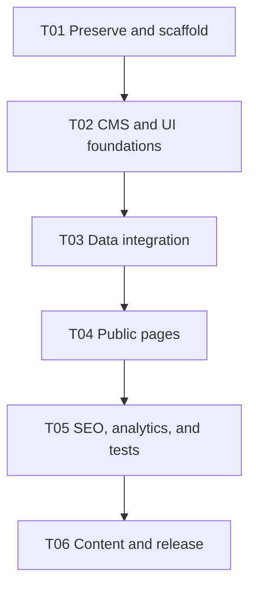

# SLGA Phase 1 — Minimal AI Agent Tasks

**Source of truth:** `TECH-SPEC.md`  
**Repository:** `slgaofficial/slgaofficial.github.io`  
**Goal:** Ship the approved Phase 1 website with the smallest practical agent team.

## 1. Team

Use only four AI roles. One agent can complete multiple tasks for its role.

| Agent | Role | Main responsibility |
| --- | --- | --- |
| A0 | Technical Lead & Platform SE | Repository setup, architecture, CI, integration, security, and merge control |
| A1 | Frontend/UI Engineer | Claude Design conversion, design system, layout, and all public pages |
| A2 | Sanity CMS & Data Engineer | Studio schemas, CMS validation, GROQ, typed data access, images, and Portable Text |
| A3 | QA & Release Engineer | Automated tests, accessibility, performance, migration checks, Vercel, and release verification |
| Founder | Content/Product Owner | Approves branding, bilingual rules, links, metrics, content, and production launch |

## 2. Rules for all agents

1. Read `TECH-SPEC.md` and this file before editing.
2. Work only on the assigned task and owned paths.
3. One agent owns a file at a time. A0 approves ownership transfers.
4. Claude Design HTML is a visual reference only. Rebuild it as Next.js components; never paste the export into production.
5. Do not add Phase 2 features.
6. Never commit secrets, private data, or unapproved content.
7. Do not deploy, disable GitHub Pages, or change cloud settings without founder approval.
8. A task is complete only when its checks pass and the agent provides a handoff.

## 3. Ownership

| Path | Owner |
| --- | --- |
| Root workspace files, lockfile, `.github/**`, environment examples | A0 |
| `apps/studio/**` | A2 |
| `apps/web/src/lib/sanity/**`, `components/portable-text/**` | A2 |
| `apps/web/src/app/**`, `components/layout/**`, `components/sections/**`, `components/ui/**`, global styles | A1 |
| Test configuration, fixtures, and `tests/**` | A3 |
| `next.config.ts`, metadata/analytics integration | A0, after A1 handoff |

Generated Sanity types and the pnpm lockfile must not be edited manually.

## 4. Execution order



After T01, A1 and A2 may work in parallel. A3 may prepare the test harness while they work. A0 integrates shared files after each handoff.

## 5. Tasks

### [ ] T01 — Preserve and scaffold

**Owner:** A0  
**Founder gate:** Approve repository replacement and legacy preservation.

Work:

- Copy the approved specification to repository root as `TECH-SPEC.md`.
- Create the annotated `legacy-site-2021` tag when authorized.
- Create the pnpm workspace with `apps/web` and `apps/studio`.
- Configure Next.js 16, strict TypeScript, Tailwind, required dependencies, Node/pnpm versions, and committed lockfile.
- Add safe `.env.example` files and `.gitignore` rules.
- Add CI for frozen install, lint, typecheck, tests, and production build.

Done when:

- Legacy Git history is preserved.
- Both applications run locally.
- Root validation commands work.
- No credentials are committed.

### [ ] T02 — Build Sanity Studio

**Owner:** A2  
**Depends on:** T01  
**Founder gate:** Provide Sanity project/dataset and approve 1–3 founder accounts.

Work:

- Configure the public `production` dataset.
- Implement `siteSettings`, `rule`, `announcement`, and `facebookFeature` exactly as specified.
- Add restricted Portable Text, image alt text, HTTPS URL, localized rule, order, and required-field validation.
- Make `siteSettings` a singleton.
- Add clear Studio navigation and document previews.

Done when:

- Invalid URLs, missing image alt text, incomplete Sinhala rules, and empty announcements fail validation.
- Only one settings document can be created normally.
- Studio runs without committed credentials.

### [ ] T03 — Build the UI foundation

**Owner:** A1  
**Depends on:** T01  
**May run with:** T02

Work:

- Place Claude Design HTML/screenshots under `design-reference/` as non-runtime references.
- Record the intended layout at 375, 768, and 1440 px.
- Implement obsidian/cyan tokens, Geist, and Noto Sans Sinhala through `next/font`.
- Add only the required shadcn components.
- Build the skip link, header, desktop/mobile navigation, main layout, and footer.
- Support keyboard navigation, visible focus, reduced motion, and 44 px targets.

Done when:

- No Claude-export HTML, CSS, scripts, placeholder data, or remote assets are used by production code.
- Mobile navigation manages focus correctly.
- Layout works at 320 px and 200% zoom.
- Color contrast meets WCAG AA.

### [ ] T04 — Build the typed Sanity data layer

**Owner:** A2  
**Depends on:** T02

Work:

- Configure a token-free, read-only Sanity server client.
- Add typed GROQ queries and generated result types.
- Query settings, active ordered rules, published announcements, one announcement slug, sitemap slugs, and up to three Facebook features.
- Exclude drafts and future announcements.
- Add 60-second revalidation.
- Add responsive Sanity image helpers and safe Portable Text renderers.

Done when:

- Public data plumbing contains no `any`.
- Pages can use typed adapters rather than direct GROQ.
- No write/preview token reaches the browser.
- Required settings fail safely; optional sections return clean empty states.

### [ ] T05 — Build the homepage

**Owner:** A1  
**Depends on:** T03, T04

Work:

- Build Hero, About, Latest Announcement, Featured Facebook Posts, Community Links, and Footer sections.
- Make Join Facebook and Join Discord the primary actions.
- Hide optional sections when empty.
- Use Server Components by default and optimized `next/image` media.
- Match the approved Claude Design direction responsively without copying its code structure.

Done when:

- No fake member count or placeholder content appears.
- No more than three Facebook feature cards render.
- No Facebook embed/API, carousel, autoplay media, or heavy animation is included.

### [ ] T06 — Build Rules, Announcements, Privacy, and 404

**Owner:** A1  
**Depends on:** T03, T04

Work:

- Build `/rules` and `/si/rules` with real language links, correct language markers, ordered localized content, and last-updated date.
- Build `/announcements` and `/announcements/[slug]`.
- Return a real 404 for unknown, draft, future, or unpublished announcements.
- Build the approved `/privacy` page and branded 404.

Done when:

- Sinhala Rules never fall back silently to English.
- Pages use semantic headings, readable article width, and machine-readable dates.
- Draft/future announcements never appear publicly.

### [ ] T07 — Add SEO, analytics, and security

**Owner:** A0  
**Depends on:** T05, T06  
**Founder gate:** Approve Privacy copy and exact production URL.

Work:

- Add canonical metadata, Open Graph cards, metadata fallbacks, and rules language alternatives.
- Add homepage Organization/WebSite JSON-LD and announcement Article JSON-LD.
- Generate sitemap and environment-aware robots rules.
- Add Vercel Analytics with only the three approved typed events.
- Add CSP, Referrer-Policy, X-Content-Type-Options, and Permissions-Policy.
- Verify no secrets or personal data enter client code or analytics.

Done when:

- Production canonicals use the exact Vercel URL and previews are non-indexable.
- Sitemap excludes drafts/future announcements.
- Analytics sends only approved event properties.
- Sanity images and Vercel Analytics work under the enforced CSP.

### [ ] T08 — Add automated tests

**Owner:** A3  
**Depends on:** T04; finish after T07

Work:

- Add deterministic CMS fixtures and mocks.
- Test dates, image helpers, rule ordering, publication filtering, metadata fallbacks, analytics mapping, and safe external links.
- Add Playwright smoke tests for navigation, CTAs, both Rules routes, announcements, unknown-slug 404, and mobile-menu keyboard behavior.
- Run axe scans on all important page types.

Done when:

- Tests do not depend on mutable production content.
- Chromium CI passes; Firefox and WebKit pass before release.
- No critical or serious axe issue remains.

### [ ] T09 — Migrate and approve content

**Owner:** A3 verifies; A2 supports entry; founder approves and publishes  
**Depends on:** T02, T04

Work:

- Inventory old rules, Google Docs text, links, claims, and assets.
- Mark each legacy item `approved`, `rewrite`, or `discard`.
- Enter approved settings, current links/count, bilingual rules, announcements, up to three Facebook cards, and approved images.
- Explicitly reject stale `24,000+`, “No Mobile,” old partner links, and unapproved superiority claims.
- Verify links while logged out and confirm image usage rights.

Done when:

- Founder approves both rule languages and every production content item.
- Studio validation passes.
- Publish/unpublish/history recovery works and a content update appears within about 60 seconds.

### [ ] T10 — QA and release

**Owner:** A3 coordinates; A0 launches  
**Depends on:** T01–T09  
**Founder gate:** Approve the exact release commit before production.

Work:

- Run CI, Playwright, axe, cross-browser/mobile, 200% zoom, keyboard, Sinhala-font, broken-link, share-preview, and analytics checks.
- Meet Lighthouse targets: Performance ≥90; Accessibility, Best Practices, and SEO ≥95.
- Configure Vercel previews/production and deploy hosted Sanity Studio.
- Document code, content, and Studio rollback procedures.
- Deliver a one-page founder guide for editing, publishing, rollback, image alt text, slug safety, and access removal.
- Merge the approved commit to `main`, verify production, and only then disable GitHub Pages.

Done when:

- Every Phase 1 acceptance criterion passes or has a founder-approved documented exception.
- Production routes, metadata, analytics, links, headers, and CMS publishing work.
- Legacy tag/history and rollback paths remain available.

## 6. Required validation

```bash
pnpm install --frozen-lockfile
pnpm lint
pnpm typecheck
pnpm test
pnpm build
pnpm test:e2e
```

## 7. Agent handoff

```md
Task:
Status: DONE | BLOCKED | PARTIAL
Files changed:
Checks run and results:
Preview/screenshots:
Assumptions or exceptions:
Founder input required:
Next owner:
```

## 8. Standard agent prompt

```text
Complete task <TASK_ID> as role <ROLE> from TASKS-MINIMAL.md.
Read TECH-SPEC.md and TASKS-MINIMAL.md before editing. Respect the assigned
file ownership and completed dependencies. Do not add Phase 2 features or
invent content, credentials, or approval. Treat Claude Design output only as
visual reference and rebuild it with proper Next.js components. Add relevant
tests, run the required checks, and return the handoff format. If blocked,
stop and name the exact missing input and owner.
```

## 9. Phase 1 exclusions

No public accounts, custom admin dashboard, LFG, events/tournaments, game or creator directories, comments, Discord bots/live counts, Facebook embeds/API, site-wide Sinhala, Tamil, PWA, or custom domain.

